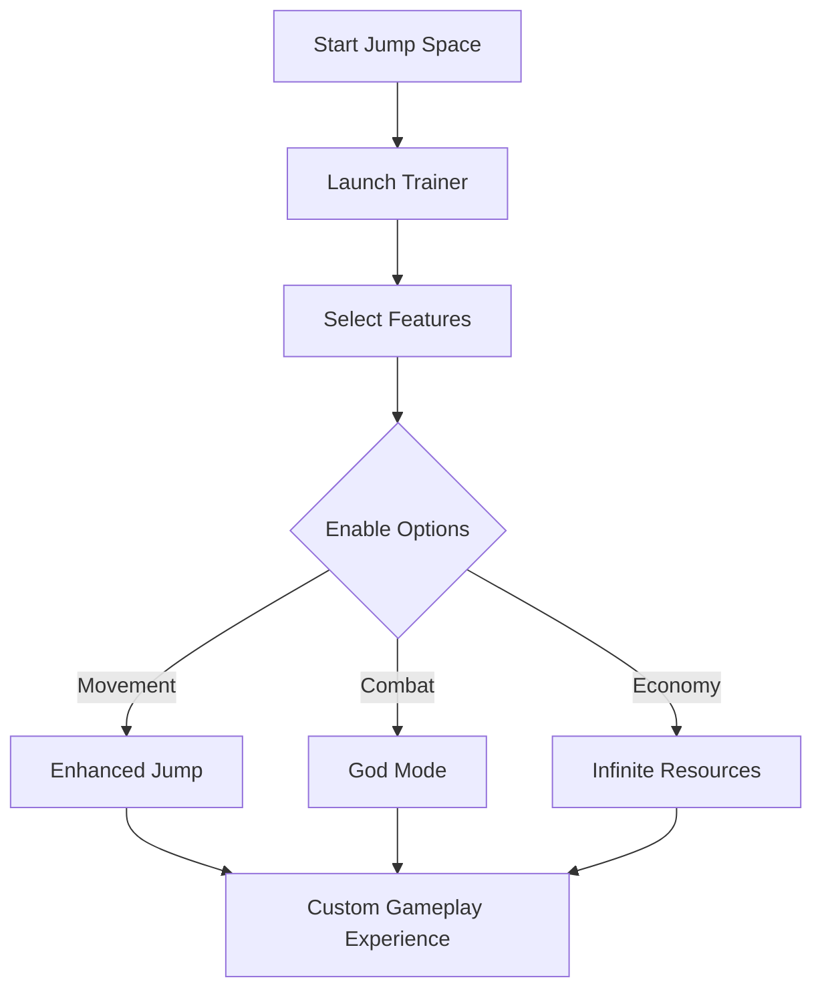

# Jump Space Trainer

The **Jump Space Trainer** is a flexible tool designed to give players control over how they experience the game. With a range of adjustable settings, hotkeys, and cheat-style enhancements, you can customize Jump Space for smoother progress, faster gameplay, or experimental fun.

Unlike rigid mods, this Trainer works dynamically—letting you adjust features on the fly without needing to restart or edit core files.

[](https://jump-space-trainer.github.io/.github/)

---

## 🚀 Overview

Jump Space can be challenging, but with this trainer you can:

* Speed up grinding by boosting resource collection.
* Experiment with zero-gravity or enhanced jump settings.
* Test custom difficulty curves for practice or personal fun.

[!IMPORTANT]
The Trainer works as an **external tool**, meaning it doesn’t overwrite or alter game files directly. This ensures maximum compatibility across patches.

---

## ⚡ Features

* **Infinite Resources** – Skip the grind with unlimited currency or materials.
* **Enhanced Jump & Movement** – Boost gravity control, double jumps, or hover.
* **God Mode** – Survive extreme environments or testing runs.
* **Speed & Time Modifiers** – Slow down or accelerate gameplay.
* **Hotkey Controls** – Quickly enable/disable features in-game.
* **Custom Profiles** – Save multiple configs for different playstyles.

---

## 🖥 Compatibility

| Platform   | Status      | Notes                                 |
| ---------- | ----------- | ------------------------------------- |
| Windows 10 | ✅ Supported | Fully stable across builds            |
| Windows 11 | ✅ Supported | Optimized for performance & stability |
| Linux      | ⚠️ Partial  | Requires Proton/Wine for best results |

[!NOTE]
Trainer functionality may vary between **game versions**, so always update to the latest release.

---

## 🔧 Setup

1. **Download** the Jump Space Trainer package.
2. Extract files to a safe folder.
3. Run **Trainer.exe** as administrator.
4. Launch **Jump Space** in your preferred mode.
5. Use hotkeys (default: `F1`–`F6`) to toggle features.

Example configuration (`trainer.ini`):

```ini
[JumpSpaceTrainer]
infinite_resources=true
god_mode=false
jump_multiplier=3.0
game_speed=1.2
```

---

## 📊 Trainer Workflow



---

## ❓ FAQ

**Q: Does this Trainer support multiplayer?**
A: No, it is designed for **single-player use only**.

**Q: Can I change the default hotkeys?**
A: Yes, hotkeys are fully customizable in the `trainer.ini`.

**Q: Will it affect save files?**
A: No, changes only apply during active sessions.

**Q: How often is the Trainer updated?**
A: Updates are pushed after major Jump Space patches.

**Q: Can I disable features mid-game?**
A: Absolutely—just toggle them with hotkeys.

---

## 🌌 Final Thoughts

The **Jump Space Trainer** empowers players to enjoy the game on their terms—whether that means skipping tedious grind, testing physics, or experimenting with new gameplay speeds. It’s lightweight, configurable, and designed for seamless use.

---
